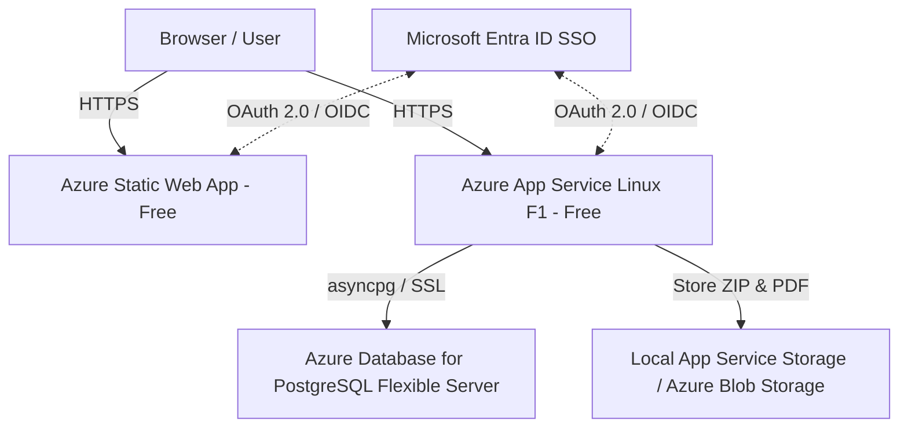

# Automation Tools Repository Hub — Enterprise Deployment Guide

This document provides a comprehensive guide for deploying the **Automation Tools Repository Hub** within a Microsoft 365 enterprise environment, utilizing Azure cloud resources at a minimal or zero cost footprint.

---

## 🏗️ 1. Enterprise Architecture Overview

For enterprise scale, reliability, and security, the local dev stack is mapped to equivalent managed Azure cloud resources:



- **Frontend**: Served as static assets via **Azure Static Web Apps** (Free tier). Provides global CDN caching and automatic SSL.
- **Backend**: Python FastAPI service running in a containerized Linux environment via **Azure App Service** (F1 Free tier).
- **Database**: **Azure Database for PostgreSQL Flexible Server** (Burstable `B1ms` instance, ~$13/month).
- **Authentication**: Gated entirely by **Microsoft Entra ID (formerly Azure AD)** utilizing App Service "Easy Auth" or direct MSAL integration.

---

## 🗄️ 2. Source Control Without GitHub (Azure DevOps)

In many corporate environments, public GitHub is restricted. **Azure DevOps Repos** offers unlimited private Git repositories for up to 5 users for free.

### Setup Steps:
1. Sign in to [Azure DevOps Portal](https://dev.azure.com/) with your enterprise work account.
2. Create a new private **Project** (e.g., `ATR-Hub`).
3. Under the project menu, navigate to **Repos** and click **Import repository** or copy the Git remote URL.
4. From your local development machine, run the following commands to push the repository:
   ```powershell
   # Rename remote if needed
   git remote remove origin
   git remote add origin https://dev.azure.com/<Your-Organization>/<Your-Project>/_git/<Your-Repo-Name>
   git branch -M main
   git push -u origin main
   ```
5. All future source code contributions will reside securely inside your corporate tenant's Azure DevOps Repos.

---

## 🔑 3. Authentication with Microsoft Entra ID (Azure AD) SSO

By using Microsoft Entra ID, team members can log in using their standard company credentials (work emails), eliminating local password databases.

### Step 1: App Registration in Azure Portal
1. Navigate to the **Azure Portal** and search for **Microsoft Entra ID**.
2. Click **App registrations** > **New registration**.
3. Name: `Automation-Tools-Repository-Hub`.
4. Supported account types: **Accounts in this organizational directory only (Single tenant)**.
5. Redirect URI:
   - Platform: **Web**
   - URL: `https://<your-backend-app-service>.azurewebsites.net/.auth/login/aad/callback`
6. Click **Register**. Copy the **Application (client) ID** and **Directory (tenant) ID**.

### Step 2: Create App Roles for Administrators
To distinguish standard users from Administrators (who can CRUD tools, dashboards, and categories):
1. Inside your App Registration, click **App roles** in the left sidebar.
2. Click **Create app role**.
3. Display Name: `Administrator`.
4. Allowed member types: **Users/Groups**.
5. Value: `admin` (this exact value is decoded by the backend code).
6. Description: `Full CRUD access over tools, version uploads, and dashboards`.
7. Click **Apply**.
8. Go to **Enterprise applications** in Entra ID > Select your App > **Users and groups** > Assign corporate users or IT administrators to this role.

### Step 3: Configure Azure App Service "Easy Auth"
The easiest way to gate the backend API is using built-in Azure authentication:
1. Open your **App Service** resource in the Azure Portal.
2. Select **Authentication** under the Settings menu > click **Add identity provider**.
3. Identity provider: **Microsoft**.
4. App registration type: **Provide the details of an existing app registration**.
5. Enter the **Application (client) ID** and **Directory (tenant) ID** saved in Step 1.
6. Restrict access: **Require authentication** (Redirect unauthenticated requests to HTTP 302).
7. Under JWT claims mapping, ensure that user roles are forwarded in the request header (`X-MS-CLIENT-PRINCIPAL-ROLES`).

---

## 👥 4. IT Admin Roles & Permissions Matrix

The system maps Entra ID App Roles directly to application permissions:

| Entra ID App Role | App Role Value | System Authorization | Allowed Actions |
|-------------------|----------------|-----------------------|-----------------|
| **Reader / User** | *None* (Default)| Standard User | Browse catalog, search tools, download ZIP scripts, download PDF manuals, open Power BI reports in new browser tabs. |
| **Administrator** | `admin` | Admin User | Full CRUD over tools, upload script ZIP versions, upload PDF manuals, CRUD Power BI dashboard items, Category CRUD management, user activity metrics review. |

> [!NOTE]
> The backend decodes the incoming token claims (specifically looking for the `roles` array containing `"admin"`) to grant administrative routes.

---

## 🚀 5. Step-by-Step Deployment Steps (Minimal Cost)

### A. Frontend Deployment (Azure Static Web Apps - $0/mo)
1. In the **Azure Portal**, search for **Static Web Apps** > click **Create**.
2. Plan: **Free F1 Tier**.
3. Source: Select **Azure DevOps** or **Local Git** (using Azure CLI).
4. Build Preset: **Vite**.
5. App Location: `/frontend`
6. Output Location: `dist`
7. Click **Create**. Once completed, copy the generated URL (e.g. `https://gray-sea-01.azurestaticapps.net`).

### B. Backend Deployment (Azure App Service - $0/mo)
1. Search for **App Services** > click **Create** > **Web App**.
2. Publish: **Code**.
3. Runtime Stack: **Python 3.12** (Linux).
4. Pricing Plan: **Free F1** ($0/month).
5. Open the **Configuration** menu > under **Application Settings**, add environment variables:
   ```env
   DATABASE_URL=postgresql+asyncpg://<db_user>:<db_password>@<db_host>:5432/provision?ssl=require
   CORS_ORIGINS=["https://<your-static-web-app-url>.azurestaticapps.net"]
   DEBUG=false
   ```
6. Deploy your backend codebase. This can be done via Azure DevOps pipelines or directly from VS Code using the **Azure App Service Extension** (Right click `backend` folder > Deploy to Web App).

### C. Database Deployment (Azure PostgreSQL - ~$13/mo)
1. Search for **Azure Database for PostgreSQL Flexible Server** > click **Create**.
2. Pricing Tier: **Burstable, B1ms** (1 vCPU, 2GB RAM, 32GB Storage).
3. Check **Compute + storage** to configure auto-grow (prevents out-of-disk crashes).
4. Networking: Add firewall rules to allow **Azure Services** (so the backend App Service can reach it).
5. Connect using pgAdmin or Azure CLI to execute schema migrations:
   ```bash
   # From your local terminal with DB env updated to Azure endpoint:
   alembic upgrade head
   ```

---

## 🔒 6. Security Hardening for Enterprise

1. **Enforce HTTPS**: Azure App Service automatically redirects HTTP traffic to HTTPS.
2. **CORS Restrictions**: Lock `CORS_ORIGINS` strictly to the Static Web App domain. Do not use `*`.
3. **Database SSL**: Ensure `?ssl=require` is appended to the connection string. Azure Database for PostgreSQL enforces SSL by default.
4. **File Upload Size Limits**: The FastAPI middleware restricts upload sizes to 50MB. PDFs are validated for `%PDF` magic bytes and restricted to 10MB to prevent Denial of Service (DoS) attacks.
5. **No Public Write Access**: Upload directories (`uploads/`) should not have execute permissions on the App Service container.

---

## 💰 7. Cost Breakdown

For a typical mid-sized corporate team (10–100 active users):

| Azure Service | Service Tier | Estimated Monthly Cost |
|---------------|--------------|------------------------|
| **Azure Static Web Apps** | Free | **$0.00** |
| **Azure App Service (FastAPI)** | Free F1 (Linux) | **$0.00** |
| **Azure Database for PostgreSQL**| Burstable B1ms | **~$13.00** |
| **Azure DevOps Repos** | Free (up to 5 developers) | **$0.00** |
| **Microsoft Entra ID (SSO)** | Free (included with M365) | **$0.00** |
| **Total Estimated Cost** | | **~$13.00 / month** |

---

## 🖥️ 8. Alternative: On-Premises IIS Deployment

If your company restricts all cloud deployments, the hub can be deployed on a local Windows Server running **IIS (Internet Information Services)**.

### Setup Steps:
1. **Frontend**:
   - Run `npm run build` in `/frontend`.
   - Copy the `dist` output folder to the IIS server (e.g. `C:\inetpub\wwwroot\atr-hub`).
   - Create a static website pointing to this directory.
2. **Backend**:
   - Install Python 3.12 on the Windows Server.
   - Install dependencies: `pip install -r requirements.txt`.
   - Set up the FastAPI service to run via Uvicorn as a Windows Service, or proxy requests via **IIS HttpPlatformHandler** (reverse proxying traffic from port 80/443 to `http://localhost:8000`).
3. **Authentication**:
   - Configure IIS to use **Windows Integrated Authentication** (Active Directory / Kerberos).
   - IIS forwards the authenticated user SID/domain account in the `REMOTE_USER` header, which the backend can read to authorize users.
